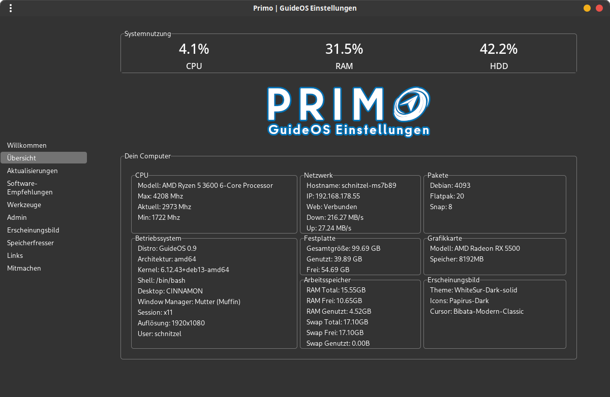

# 🚀 Primo - GuideOS System Management Tool

<div align="center">



**The Ultimate System Management Tool for GuideOS**

[](LICENSE)
[](https://python.org)
[](https://www.linux.org/)

</div>

## 📋 Overview

**Primo** is the central system management and configuration tool for GuideOS. It provides an intuitive graphical user interface for managing all important system aspects and is a hardfork of the proven [PiGro – Just Click It](https://github.com/actionschnitzel/PiGro-Aid-) tool.

## ✨ Features

### 🏠 **Dashboard**
- **System Overview**: CPU, RAM, GPU and storage monitoring
- **Hardware Detection**: Automatic detection of AMD, NVIDIA and Intel GPUs
- **Temperature Monitoring**: Live CPU temperature display
- **Memory Analysis**: Detailed RAM and GPU memory information

### 🔄 **Update Management**
- **One-Click Updates**: Update all system packages with one button
- **Package Manager**: APT, Snap and Flatpak support
- **Live Terminal**: Real-time display of update processes
- **Smart Repair**: Automatic fixing of broken packages

### 🎨 **System Customization**
- **Theme Management**: Customize desktop themes and appearance
- **Icon Packs**: Various icon sets to choose from
- **Cursor Themes**: Configure mouse cursor designs
- **Wallpapers**: Background management

### 📦 **Software Center**
- **Categorized Apps**: Gaming, Office, Multimedia, Development Tools
- **One-Click Installation**: Easy software installation
- **Multi-Format Support**: APT, Snap, Flatpak and AppImage
- **Recommendations**: Curated software recommendations

### 🔧 **Advanced Tools**
- **Expert Tools**: Terminal-based system administration
- **Package Sources**: Repository management
- **System Repair**: Fix-tools for common problems
- **Disk Analysis**: Storage space management

### 🌐 **Additional Features**
- **Links Collection**: Useful resources and documentation
- **Multilingual**: German localization
- **Contributors**: Community information
- **Welcome Assistant**: Guided setup for new users

## 🔧 Installation

### Build from DEB Package:

```bash
# Clone repository
git clone https://github.com/GuideOS/primo-di-tutto.git
cd primo-di-tutto

# Create DEB package
dpkg-source --build ./

# Install (as root)
sudo dpkg -i ../primo_*.deb
sudo apt-get install -f  # Resolve dependencies if needed
```

### Dependencies:

```bash
sudo apt update
sudo apt install python3 python3-tkinter python3-pil python3-pil.imagetk \
                 python3-psutil python3-requests glxinfo lspci
```

## 🚀 Usage

### Start Application:

```bash
# As regular user
python3 /opt/primo-di-tutto/src/main.py

# Or via desktop icon (after installation)
primo
```

### System Requirements:
- **OS**: Linux (Debian/Ubuntu based)
- **Python**: 3.7 or higher
- **RAM**: At least 2GB recommended
- **Display**: 1024x768 or higher

## 🎯 Main Components

| Component | Description | Features |
|-----------|-------------|----------|
| **Dashboard** | System Overview | Hardware monitoring, GPU detection |
| **Updates** | Package Management | APT/Snap/Flatpak updates |
| **System** | Configuration | Themes, icons, desktop settings |
| **Software** | App Installation | Categorized software collection |
| **Tools** | Expert Tools | Terminal tools, repairs |

## 🔍 Hardware Support

### GPU Detection:
- ✅ **NVIDIA**: GeForce, Quadro, Tesla (via nvidia-smi)
- ✅ **AMD/ATI**: Radeon RX/Pro Series (via lspci + glxinfo)
- ✅ **Intel**: HD/UHD/Iris Graphics (via integrated detection)

### CPU Monitoring:
- ✅ **Usage**: Live CPU percentage display
- ✅ **Temperature**: Thermal sensor support
- ✅ **Frequency**: Current clock rate

## 🐛 Troubleshooting

### Common Issues:

**GPU not detected?**
```bash
# Install OpenGL tools
sudo apt install mesa-utils

# Check hardware
lspci | grep -i vga
glxinfo | grep "Video memory"
```

**Updates failing?**
```bash
# Repair packages
sudo apt update
sudo apt --fix-broken install
sudo dpkg --configure -a
```

**Python dependencies missing?**
```bash
# Install all Python modules
sudo apt install python3-dev python3-setuptools
pip3 install --user -r requirements.txt
```

## 🤝 Contributing

Primo is Open Source! Contributions are welcome:

1. **Fork** the repository
2. **Create** branch: `git checkout -b feature/new-feature`
3. **Commit** changes: `git commit -am 'Add new feature'`
4. **Push** to branch: `git push origin feature/new-feature`
5. **Create** Pull Request

### Development:

```bash
# Development Setup
git clone https://github.com/GuideOS/primo-di-tutto.git
cd primo-di-tutto/primo-di-tutto

# Run directly (without installation)
python3 src/main.py
```

## 📄 License

This project is licensed under the **GNU General Public License v3.0**. See [LICENSE](LICENSE) for details.

## 🙏 Credits

- **Based on**: [PiGro – Just Click It](https://github.com/actionschnitzel/PiGro-Aid-)
- **Developed for**: [GuideOS](https://github.com/GuideOS)
- **Community**: All contributors and testers

## 📞 Support

- **Issues**: [GitHub Issues](https://github.com/GuideOS/primo-di-tutto/issues)
- **Documentation**: [GuideOS Docs](https://github.com/GuideOS)
- **Community**: [GuideOS Discord/Forum]

---

<div align="center">

**Made with ❤️ for the GuideOS Community**

[Website](https://guideos.org) • [GitHub](https://github.com/GuideOS) • [Documentation](https://docs.guideos.org)

</div>
